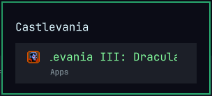

# OmaMenu

**Stock Omarchy menu, with one habit fixed: highlighted rows that would
normally die behind an ellipsis scroll far enough to read.**



Works in Apps, Fonts, Gaming, plugin enable/disable/clone/remove (including
the id subline), and search results. Idle rows still elide. Highlighted rows
that actually overflow pause, scroll once through the hidden tail, pause,
then reset — no ping-pong, no endless wrap.

## Why

Omarchy’s menu is narrow on purpose. Long labels (`Heroic (Epic Games)`,
`RetroArch Game Launcher`, `io.github.…` plugin ids) get cut with `…`.
Hovering or arrowing onto them used to leave you guessing. OmaMenu shows the
rest when you care, and stays quiet when the name already fits.

It also keeps the stock Apps filter: `/usr/share/omarchy/default/omarchy/launcher.hides`
plus the usual `NoDisplay` / `OnlyShowIn` scan, so Avahi and friends stay out
of the list.

## Install

```sh
omarchy plugin add https://github.com/AlxWolfenstein97/omamenu.git --enable
```

That clones into `~/.config/omarchy/plugins/io.github.alxwolfenstein97.omamenu`
and replaces stock `omarchy.menu` (same `clonedFrom` routing the built-in
clone path uses). Or from a checkout:

```sh
~/.config/omarchy/plugins/io.github.alxwolfenstein97.omamenu/install.sh
```

**Needs:** Omarchy shell / Quickshell. Super+Space opens the menu.

No extra packages — OmaMenu is a Quickshell menu clone, not a Pillow mockup
carousel. (The Style theme extenders that *do* draw PNGs pull `python-pillow`
themselves; see [Chroma](https://github.com/AlxWolfenstein97/chroma) for the
family map.)

## Disable vs remove

| Action | What happens |
|--------|----------------|
| `./uninstall.sh` | Disables this clone and re-enables stock `omarchy.menu`. No packages to drop. |
| `omarchy plugin remove …` | Deletes the plugin folder after uninstall. |

**Full wipe** — copy-paste:

```sh
~/.config/omarchy/plugins/io.github.alxwolfenstein97.omamenu/uninstall.sh
omarchy plugin remove io.github.alxwolfenstein97.omamenu
```

## Notes

- Third-party menu clones do not always receive `shell.appLibrary`. OmaMenu
  falls back to `DesktopEntries` + a local `AppSearch.js` copy so Apps still
  populate, with the same hide list as stock.
- Bar widget IPC targets stay `omarchy.menu`; the shell routes them through
  `clonedFrom`.

## Limits

- **Icons** — when `shell.appLibrary` is available, app rows use
  `appLibrary.iconSource` like stock (disk `iconIndex` scan across installed
  themes’ apps/devices). That survives missing theme icon packs such as
  Vantablack’s `Yaru-gray` / White’s `Yaru-grey`; fallbacks still resolve from
  other Yaru/hicolor trees. Without `appLibrary`, icons fall back to
  `Quickshell.iconPath` and may look wrong on those themes.
- Marquee only runs on highlighted overflow rows; idle rows still elide.
## Credits

- [Omarchy](https://omarchy.org/) — the first-party menu this clones.
- [OMCP](https://github.com/btsouth/omarchy-omcp) — MCP desktop bridge
  (screenshots, themes, window focus, …). This plugin was basically built
  through it: open the menu, poke Apps / Gaming / Fonts / plugin pickers,
  catch empty lists and mid-marquee bugs, swap to Hackerman for the preview,
  repeat. Install with
  `omarchy plugin add https://github.com/btsouth/omarchy-omcp --enable`.

## License

MIT — see [LICENSE](LICENSE). Built on Omarchy’s first-party menu.
